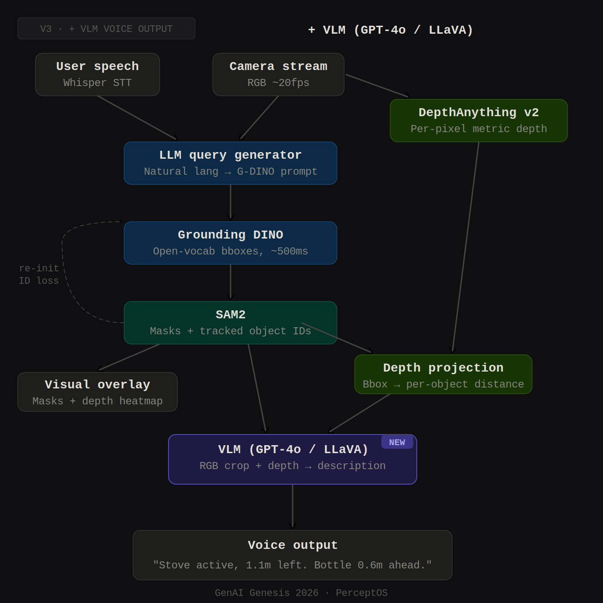

# Mind Two

This repository is a customized live object-finding runtime built on top of the original Streaming Grounded SAM 2 repo:

- Original repo: https://github.com/patrick-tssn/Streaming-Grounded-SAM-2

The current live pipeline combines:

- OpenAI GPT-based query extraction
- Grounding DINO for text-conditioned detection
- SAM 2 for mask initialization and tracking
- Depth Anything V2 Metric for distance estimation
- Optional audio query input with OpenAI speech-to-text

The main entrypoint is [run_live.py](/home/kevin/Documents/Projects/mind-two/run_live.py).

## Toolchain Setup



High-level architecture for the current live perception pipeline.

[](https://www.youtube.com/watch?v=kxXIVC9BiPU)

Demo video:
https://www.youtube.com/watch?v=kxXIVC9BiPU

The runtime is split into a few concrete layers:

- Query input layer
  - Text mode uses a one-shot static query.
  - Audio mode listens for a wake phrase, records a spoken command, and transcribes it with OpenAI speech-to-text.
  - Code: [live_io/query_input.py](/home/kevin/Documents/Projects/mind-two/live_io/query_input.py), [live_io/audio_input.py](/home/kevin/Documents/Projects/mind-two/live_io/audio_input.py)

- Frame input layer
  - Webcam mode reads directly from a local camera.
  - Server mode polls the latest JPEG frame from the FastAPI stream endpoint.
  - Code: [live_io/frame_source.py](/home/kevin/Documents/Projects/mind-two/live_io/frame_source.py), [rtc_client_server/server.py](/home/kevin/Documents/Projects/mind-two/rtc_client_server/server.py)

- Query understanding layer
  - The GPT model rewrites the user request into structured target, anchor, and support-surface phrases.
  - The runtime can override anchors with a fixed configured list.
  - Code: [llm/openie.txt](/home/kevin/Documents/Projects/mind-two/llm/openie.txt), [live/query_pipeline.py](/home/kevin/Documents/Projects/mind-two/live/query_pipeline.py)

- Detection and tracking layer
  - Grounding DINO performs text-conditioned detection.
  - SAM 2 initializes masks from detection boxes and then tracks over time.
  - Code: [live/tracking_pipeline.py](/home/kevin/Documents/Projects/mind-two/live/tracking_pipeline.py), [live_runtime.py](/home/kevin/Documents/Projects/mind-two/live_runtime.py)

- Depth and scene reasoning layer
  - Depth Anything V2 Metric estimates full-frame depth.
  - The runtime reads depth only inside tracked masks and computes scene relations.
  - Code: [live/depth_pipeline.py](/home/kevin/Documents/Projects/mind-two/live/depth_pipeline.py), [live/scene_pipeline.py](/home/kevin/Documents/Projects/mind-two/live/scene_pipeline.py)

- Memory and output layer
  - Recent target observations are stored in scene memory.
  - The OpenCV overlay displays tracking state, depth, relations, and memory fallback messages.
  - Code: [live/memory_pipeline.py](/home/kevin/Documents/Projects/mind-two/live/memory_pipeline.py), [scene_memory.py](/home/kevin/Documents/Projects/mind-two/scene_memory.py), [live/overlay_renderer.py](/home/kevin/Documents/Projects/mind-two/live/overlay_renderer.py)

## Model Pipeline

The live path in [run_live.py](/home/kevin/Documents/Projects/mind-two/run_live.py) works like this:

1. Input enters as either:
   - a text query from `--query`, or
   - an audio command captured after the wake phrase `hello`

2. The query is queued and sent to the LLM extraction step.
   - The extraction produces:
     - `targets`
     - `anchors`
     - `support_surfaces`

3. Anchor selection is resolved.
   - Default: fixed anchors
   - Optional: LLM-derived anchors

4. Grounding DINO runs on the current frame for the active target phrase.
   - This produces candidate boxes for target initialization or re-detection.

5. SAM 2 loads the frame and initializes tracked objects from those boxes.
   - After initialization, SAM 2 handles intermediate tracking updates between re-detections.

6. Depth Anything V2 Metric runs on the full frame in a background worker.
   - The runtime samples depth values only inside the tracked SAM masks.
   - Median object depth is used for the distance overlay and scene reasoning.

7. Context detections can run in parallel.
   - Anchor detections
   - Support-surface detections
   - Optional hand detections

8. Scene reasoning and memory update from the tracked target state.
   - Spatial relations are computed from target, anchors, supports, and hand context.
   - Stable target observations can be written into scene memory.

9. The UI overlay renders the current state.
   - query summary
   - tracking labels
   - depth estimates
   - spatial relations
   - memory fallback text when tracking is lost

In short:

`query/audio` -> `LLM extraction` -> `Grounding DINO boxes` -> `SAM 2 tracking` -> `Depth Anything masked distance` -> `scene reasoning + memory` -> `overlay`

## Setup

Create an environment and install:

```bash
conda create -n sam2 python=3.10 -y
conda activate sam2
pip install -e .
```

If you use GPT models, set your API key in `llm/.env`:

```bash
API_KEY="..."
API_BASE=""
```

`API_BASE` is optional and only needed for Azure-style routing in the existing wrapper.

Download the required checkpoints:

```bash
cd checkpoints
./download_ckpts.sh
```

```bash
cd gdino_checkpoints
hf download IDEA-Research/grounding-dino-tiny --local-dir grounding-dino-tiny
```

```bash
cd depth_anything_checkpoints
./download_metric_indoor_ckpts.sh
```

## Main Run Commands

### Webcam + text query

This is the simplest local run:

```bash
python run_live.py --model gpt-4o-2024-05-13
```

Pass an explicit text query:

```bash
python run_live.py --model gpt-4o-2024-05-13 --query "I am trying to find my phone"
```

Use a different camera:

```bash
python run_live.py --model gpt-4o-2024-05-13 --camera-index 1
```

### Webcam + audio query input

Audio query mode listens for the wake phrase `hello`, then records the spoken command and transcribes it with `gpt-4o-transcribe`.

```bash
python run_live.py --model gpt-4o-2024-05-13 --query-input audio
```

If your microphone is not the default input device:

```bash
python run_live.py --model gpt-4o-2024-05-13 --query-input audio --audio-input-device-index 1
```

If you want to override the wake phrase:

```bash
python run_live.py --model gpt-4o-2024-05-13 --query-input audio --wake-phrase "hello"
```

### Server frame source

The live runner can also read frames from the local FastAPI server endpoint instead of a directly attached webcam.

Start the server:

```bash
python rtc_client_server/server.py
```

Then run the live pipeline against the server stream:

```bash
python run_live.py --model gpt-4o-2024-05-13 --frame-source server --stream-url http://127.0.0.1:5000/stream/latest-frame
```

If you also want audio query input while using server frames:

```bash
python run_live.py --model gpt-4o-2024-05-13 --frame-source server --stream-url http://127.0.0.1:5000/stream/latest-frame --query-input audio
```

### Raspberry Pi client for the server

If you are using the included WebRTC client stream path, the client entrypoint is:

```bash
python rtc_client_server/client.py
```

That client currently has its `server_url` set directly inside [rtc_client_server/client.py](/home/kevin/Documents/Projects/mind-two/rtc_client_server/client.py), so update it there if needed.

## Query Input Modes

### Text input

Default mode:

```bash
python run_live.py --model gpt-4o-2024-05-13
```

### Audio input

Enabled with:

```bash
python run_live.py --model gpt-4o-2024-05-13 --query-input audio
```

Useful audio flags:

```bash
--wake-phrase hello
--transcription-model gpt-4o-transcribe
--audio-input-device-index 1
--audio-silence-threshold 550
--min-silence-duration-s 1.0
```

## Anchor Modes

Anchors can come from either:

- a fixed configured list
- the LLM extraction output

### Fixed anchors

This is the default behavior.

Current fixed anchor list:

- `water bottle`
- `rubber duck`
- `marker`
- `usb`
- `towel`
- `snack`

Run with default fixed anchors:

```bash
python run_live.py --model gpt-4o-2024-05-13
```

Run with an explicit custom fixed anchor list:

```bash
python run_live.py --model gpt-4o-2024-05-13 --anchor-source fixed --fixed-anchors "water bottle,rubber duck,marker,usb,towel,snack"
```

### LLM-derived anchors

Switch to anchors from the LLM extraction:

```bash
python run_live.py --model gpt-4o-2024-05-13 --anchor-source llm
```

## Useful Runtime Flags

Disable depth:

```bash
python run_live.py --model gpt-4o-2024-05-13 --disable-depth
```

Use the server frame source:

```bash
python run_live.py --model gpt-4o-2024-05-13 --frame-source server
```

Lower target detection thresholds are now the defaults:

- `--target-box-threshold 0.30`
- `--target-text-threshold 0.25`

## Notes

- The audio wake detection in this version is transcription-based, not a local keyword spotter.
- In audio mode, say `hello`, then briefly pause, then say the command.
- The live pipeline entrypoint is [run_live.py](/home/kevin/Documents/Projects/mind-two/run_live.py).
- The stream server entrypoint is [rtc_client_server/server.py](/home/kevin/Documents/Projects/mind-two/rtc_client_server/server.py).

## Citations

If you use this repository, cite the upstream projects and papers it builds on.

### Original Streaming Grounded SAM 2 repo

- Patrick Tseng-Sheng Tsai, Streaming Grounded SAM 2:
  https://github.com/patrick-tssn/Streaming-Grounded-SAM-2

### SAM 2

- Ravi, N., Gabeur, V., Hu, Y.-T., et al. "SAM 2: Segment Anything in Images and Videos."
  https://arxiv.org/abs/2408.00714

### Grounding DINO

- Liu, S., Zeng, Z., Ren, T., et al. "Grounding DINO: Marrying DINO with Grounded Pre-Training for Open-Set Object Detection."
  https://arxiv.org/abs/2303.05499

### Depth Anything V2

- Yang, L., Kang, B., Huang, Z., et al. "Depth Anything V2."
  https://arxiv.org/abs/2406.09414

### Segment Anything 2 codebase

- Official SAM 2 repository:
  https://github.com/facebookresearch/sam2

### Grounded-SAM-2

- IDEA Research Grounded-SAM-2 repository:
  https://github.com/IDEA-Research/Grounded-SAM-2
